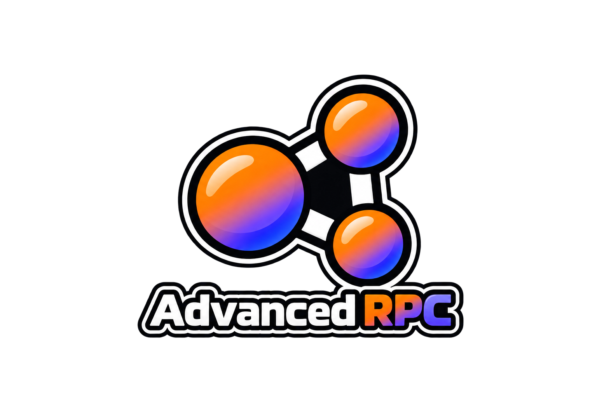

  

<h1 align="center">AdvancedRPC for BeamNG.drive</h1>

  Customize your Discord activity with live driving information, personal profiles, images, and more.

  <a href="https://github.com/wolaryofficial/BMNG_AdvancedRPC/releases">Downloads</a>
  &middot;
  <a href="#installation">Installation</a>
  &middot;
  <a href="#using-your-own-discord-application">Bridge setup</a>
  &middot;
  <a href="https://github.com/wolaryofficial/BMNG_AdvancedRPC/issues">Issues &amp; suggestions</a>

AdvancedRPC expands BeamNG.drive's Discord Rich Presence with editable text, automatic profiles, and live game data. Configure everything directly in **Esc → Mods → AdvancedRPC**.

**The bridge is optional.** The default **BeamNG Native** mode works through the game's built-in Discord connection. Use **Custom Application** mode and the bridge when you want to connect your own Discord application and use additional activity features.

## Features

- **Live game information:** map, vehicle, speed, RPM, gear, fuel, and session duration.
- **Custom profiles:** create, duplicate, reorder, import, and export profiles as JSON.
- **Automatic rules:** switch profiles by game context, map, vehicle, speed, or pause state.
- **Images and captions:** use asset keys or public HTTPS image URLs, add hover text, and assign images to specific maps and vehicles.
- **Text templates:** insert live variables, define fallback text, and rotate between multiple status messages.
- **Career support:** display career activities, balance, BeamXP, level, and profile name.
- **BeamMP support:** show available server information and player counts.
- **In-game preview:** inspect the active profile, resolved variables, and outgoing activity.

## Connection modes

| Feature | BeamNG Native | Custom Application |
| --- | --- | --- |
| Bridge required | No | Yes, on Windows |
| Discord Application ID | Uses BeamNG's application | Your own Application ID |
| Custom text, profiles, images, and captions | Yes | Yes |
| Custom activity name, type, and member-list text | No | Yes |
| Clickable text and image links | No | Yes |
| Up to two buttons and Discord timers | No | Yes |
| BeamMP party size | No | When player count and capacity are available |

Discord controls the final appearance and visibility of activity fields.

## Installation

1. Download `advanced_rpc_1.0.0.zip` from [GitHub Releases](https://github.com/wolaryofficial/BMNG_AdvancedRPC/releases).
2. Place the ZIP in the `mods` directory inside your active BeamNG.drive user folder. **Do not extract it.** See the [official installation guide](https://documentation.beamng.com/tutorials/mods/installing-mods/) if you need help finding the folder.
3. Enable AdvancedRPC in the game's Mod Manager and keep the Discord desktop app running.
4. Enable Rich Presence and Discord Rich Presence in BeamNG's settings, and allow activity sharing in Discord.
5. Open **Esc → Mods → AdvancedRPC**. Leave **Connection mode** set to **BeamNG Native** to start without a bridge or an Application ID.

Use the packaged mod ZIP, rather than GitHub's automatically generated source-code ZIP. When updating from CustomRPC, remove the old mod ZIP before installing AdvancedRPC; existing settings and profiles are imported automatically.

## Using your own Discord application

The bridge connects AdvancedRPC to the Discord desktop app on Windows. It is distributed separately from the game mod and is not included in the BeamNG mod ZIP.

1. Create an application in the [Discord Developer Portal](https://discord.com/developers/applications) and copy its **Application ID**.
2. Download **AdvancedRPC Bridge.exe** from [GitHub Releases](https://github.com/wolaryofficial/BMNG_AdvancedRPC/releases) and keep it in a permanent folder.
3. Run the bridge. Its icon appears in the Windows system tray.
4. In **Esc → Mods → AdvancedRPC → General**, select **Custom Application** and paste your Application ID.
5. Keep Discord and the bridge running while you play. Configure your profiles, images, buttons, and timers in the mod's settings.

Only the public Application ID is needed. No Discord account token, bot token, or client secret is required.

### Start with Windows

Right-click the bridge's tray icon and enable **Start with Windows**. Use the same option to disable automatic startup. If you move the executable, run it from its new location and enable startup again.

## Images and status text

In the **Images** tab, enter an asset key or a direct, publicly accessible HTTPS image URL. A link to an image-hosting page is not an image URL. Large and small images have separate captions, shown when someone hovers over them in Discord.

BeamNG Native uses BeamNG's asset keys, such as `lvl_italy`, or your image URLs. Custom Application uses assets uploaded to your own application or image URLs; BeamNG's asset keys are not shared with your application.

Text fields and image captions support `{variable}` and `{variable|fallback}`. For example:

| Field | Example |
| --- | --- |
| Details | `Driving {vehicle|a vehicle}` |
| State | `{map|Main menu} · {speed|Parked}` |
| Large image caption | `Exploring {map|BeamNG.drive}` |
| Career details | `Career · {career_activity|Exploring}` |

The **Text** tab lists the available variables. Choose a profile in **General**, or assign it an automatic rule; editing or previewing a profile does not activate it.

## Troubleshooting

- **No activity appears:** check the mod's connection status, confirm Discord is running, and verify that Rich Presence and activity sharing are enabled.
- **Custom Application does not connect:** confirm the Application ID, start the bridge, and use **Reconnect** in the mod's settings.
- **An image is missing:** check its direct HTTPS URL or the asset key belonging to the selected application's mode. BeamNG may block external images in the preview even when Discord accepts them.
- **Updates seem delayed:** the default interval is 5 seconds and can be set from 1 to 60 seconds. Context changes take priority, but Discord may delay updates and rapid changes are combined to respect its limits.
- **Another presence mod is installed:** disable it to avoid competing updates to the same Discord activity.

## Contributing

The source code is available in this repository. Improvements, bug fixes, and new features are welcome — including ideas the original author has not thought of yet. Share a suggestion, report a bug, or submit a pull request.

To build the mod ZIP and Windows bridge from source, run `./build.ps1` in PowerShell on Windows. Add `-PrepareGitHub` to prepare the upload folder. Build outputs are written to `dist`.

  Version 1.0.0 · made by wolary (w0kx)

